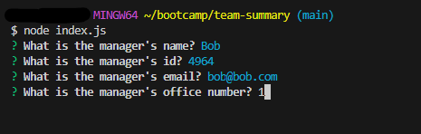

# Team Summary

## Description
I struggled a lot with this challenge for various reasons from getting starting to feeling unwell over the weekend. I have been able to get the respective javascript files to past the test via npx jest and was able to get started with help from a tutor. I will be continuing with this assignment in my own time as I believe I have a good idea on what direction and steps to take next thanks to the notes my tutor provided to me at the end of index.js.

The purpose for the app is to generate a team from the terminal and for it to be outputted to a HTML page. While I was unable to get that far, I am happy to have a solid start with my files passing the tests provided.

## Screenshot

## Credits:
I used the following to help me reach my final code:
* Tutoring session

## Lisence
MIT Lisence
